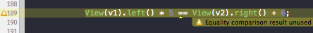

AutoLayoutDSL
=============

A straightforward C++ DSL to more concisely define layout constraints.

[](http://cocoadocs.org/docsets/AutoLayoutDSL)
[](http://cocoadocs.org/docsets/AutoLayoutDSL)

Constraint Expressions
----------------------

The standard syntax for defining layout constraints is verbose. For example, to specify the x offset of one button
relative to another with a 5 point gap between them, one would write:

````objc
self.view addConstraint:[NSLayoutConstraint constraintWithItem:_button2
                                                      attribute:NSLayoutAttributeLeft
                                                      relatedBy:NSLayoutRelationEqual
                                                         toItem:_button1
                                                      attribute:NSLayoutAttributeRight
                                                     multiplier:1.0
                                                       constant:5.0]];
````

With the layout DSL, this would simply be written as:

````objc
View(_button2).left == View(_button1).right + 5.0;
````

or more naturally as:

````objc
View(_button1).right + 5.0 == View(_button2).left;
````

That's it.  When this expression is executed, the `NSLayoutConstraint` object will be created and automatically
installed in the nearest common ancestor of `_button1` and `_button2`.

### Adding some sugar

If you're willing to compile your code as objective-C++, you can access an even more consise constraint definition.
Just `#import "UIView+AutoLayoutDSLSugar.h"` and the constraint referred to above can be defined as:

````objc
_button1.right + 5.0 == _button2.left;
````

Now that's just about perfect.

### Constraint installation

As mentioned before, just declaring a constraint expression is sufficient to install that constraint in the nearest
common ancestor of the referenced views, but if you'd rather install the constraint yourself, you can simply use a
constraint expression in place of an actual `NSLayoutConstraint` object in a call to `addConstraint:`. The act of
passing the expression to the method will prevent the constraint from being automatically installed.

````objc
[self.view addConstraint:View(_button1).left == View(_button2).right + 5.0];
````

Basically, a constraint expression can be used anywhere an `NSLayoutConstraint` object is expected. For example,
multiple constraints can be installed as follows:

````objc
[self.view addConstraints:@[View(_button1).right + 5.0 == View(_button2).left,
                            View(_button2).right + 5.0 == View(_button3).left]];
````

But why bother when this is so much more concise?

````objc
View(_button1).right + 5.0 == View(_button2).left;
View(_button2).right + 5.0 == View(_button3).left;
````

### Constraints referencing superviews

To specify a constraint on a view relative to its superview, just omit the `UIView*` parameter from the `View`
specification:

````objc
View().left + 5.0 == View(_button1).left;
````

### Priorities

Priorities can be specified in a constraint expression by using the `^` operator, like so:

````objc
View(_button1).left == View(_button2).right + 5.0 ^ 999.0;
````

### Constraint Identification

You can add an identifier to a single constraint or a group of constraints to more easily remove and replace
them, when necessary.  There are a few ways to accomplish this.

#### Using identifiers with single constraint

Just like adding priorities, identifiers can be added to a constraint expression by using the `^` operator, like so:

````objc
View(_image).width == View(_image).height * aspectRatio ^ @"maintainAspect";
````

#### Adding an identifier to a group of constraints

You can group constraints by assigning them the same identifier:

````objc
View(_avatar).left == View().left + 5.0 ^ @"A group of constraints";
View(_label).left == View(_avatar).right + StandardHorizontalGap ^ @"A group of constraints";
````

But a much cleaner way is by using the contraint grouping macros:

````objc
BeginConstraintGroup(@"A group of constraints")

View(_avatar).left == View().left + 5.0;
View(_label).left == View(_avatar).right + StandardHorizontalGap;

EndConstraintGroup;
````

### Finding constraints

To find a single constraint given its identifier:

````objc
NSLayoutConstraint *constraint = [self.view constraintWithID:@"identifier"];
````

To find all constraints with a given identifier:

````objc
NSArray *constraint = [self.view constraintsWithID:@"identifier"];
````

To find all constraints referencing a given view:

````objc
NSArray *constraints = [self.view constraintsReferencingView:_button1];
````

### Removing constraints

To remove a constraint, simply call `remove`

````objc
NSLayoutConstraint *constraint = [self.view constraintWithID:@"identifier"];
[constraint remove];
````

Caveats
-------

### Objective-C++ (C++11)

This DSL requires that your source file be compiled as Objective-C++ (just change its extension to .mm).  This may be
a concern to some.  If you don't want to deal with any potential problems this may cause, you can still use the DSL by
defining all of your constraints in a separate file using categories.

### Auto vs. manual constraint installation

I used some unorthodox methods to acheive the results I was looking for.  The ability to have a constraint
auto-install itself is acheived by installing the newly built `NSLayoutContraint` object from the destructor of the
internal `ConstraintBuilder` object.  The ability to use a constraint expression in place of an `NSLayoutConstraint`
object is acheived through an overloaded cast operator on the internal `ConstraintBuilder` class.  In order to prevent
multiple constraint installs, any casting the `ConstraintBuilder` object will transfer ownership of the newly built
`NSLayoutConstraint` object to the caller, so when the `ConstraintBuilder` object is destroyed, there is no
`NSLayoutConstraint` object to install.  Unfortunately, this prevents directly obtaining a pointer to an
_auto-installed_ constraint:

````objc
// The following constraint has not been automatically installed
NSLayoutConstraint *constraint = View(_avatar).left == View().left + 5.0;
````

This is a small price to pay, since the auto-install behavior can easily be invoked:

````objc
[constraint install];
````

Regardless, this kind of _magic_ behavior will be disliked by some.

### Compiler warnings

Unfortunately, the compiler/static analyzer will most likely try to warn you that your free-standing constraint
expressions are unused.



The only way to prevent this is to disable the warning.  You can wrap your constraint expressions like so:

````objc
_Pragma( "clang diagnostic push" )
_Pragma( "clang diagnostic ignored \"-Wunused-value\" " )

View(_avatar).left == View().left + 5.0;

_Pragma( "clang diagnostic pop")
````

But that's pretty ugly.  To clean this up a bit, I've added a couple of macros to wrap constraints with:

````objc
BeginConstraints

View(_avatar).left == View().left + 5.0;

EndConstraints;
````

The constraint grouping macros `BeginConstraintGroup()` and `EndConstraintGroup` also disable these warnings.

### Syntax

The main expression syntax is pretty fixed, but the method of adding identifiers and priorities may change.
The code currently allows for these to be added with the `^` operator, and also the `,` operator.  I'm open
to suggested improvements.

Alternatives
------------

There are quite a few attempts to improve on the default constraint syntax.  These are just a few that caught
my attention:

- [NSLayoutEquations](https://github.com/gormster/NSLayoutEquations)
- [NSLayoutConstraint+ExpressionFormat](https://github.com/enderlabs/NSLayoutConstraint-ExpressionFormat)
- [KeepLayout](https://github.com/iMartinKiss/KeepLayout)
- [FLKAutoLayout](https://github.com/dkduck/FLKAutoLayout)
- [Masonry](https://github.com/cloudkite/Masonry)
- [Parus](https://github.com/DAlOG/Parus)


Installation
------------

AutoLayoutDSL is available with CocoaPods[http://cocoapods.org], to install
simply add the following line to your Podfile:

    pod AutoLayoutDSL

## Author

David Whetstone <david@humblehacker.com>

### Acknowledgements

The constraint expressions are my own design, but the ideas of constraint identification, grouping, and self-install
are all thanks to [Erica Sadun](http://ericasadun.com) and her excellent book
[iOS Auto-Layout Demystified](http://www.informit.com/store/ios-auto-layout-demystified-9780133440652).  Much of the
code related to these features are massaged versions of the sample code included with that book, found
[here](https://github.com/erica/Auto-Layout-Demystified).

## License

AutoLayoutDSL is available under the MIT license. See the LICENSE file for more info.

